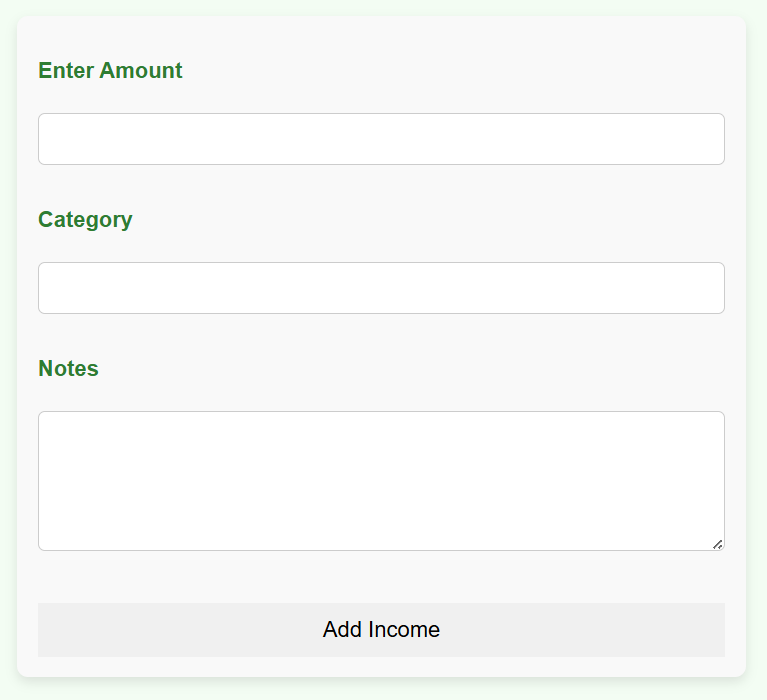
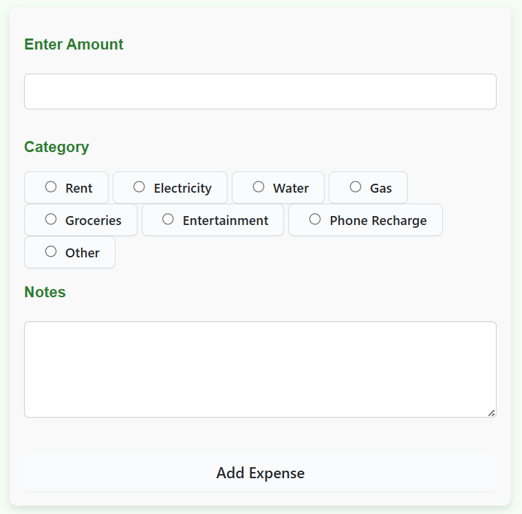
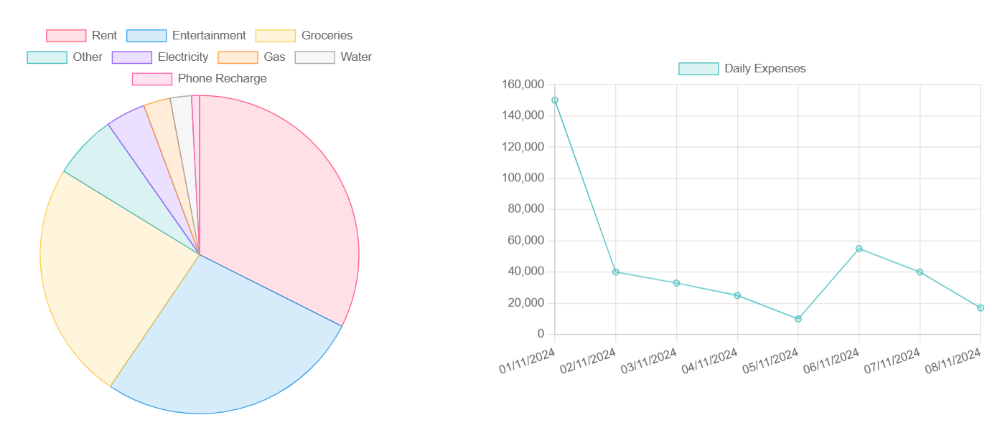

# 💰 Budgetify – Personal Budget Tracker & AI Financial Advisor

**Budgetify** is a personal budgeting web application built with Node.js, Express, and PostgreSQL. It helps users manage their income and expenses, automatically calculates savings, visualizes daily expenses, and uses Google Gemini AI to generate personalized budgeting recommendations.

---

## ✨ Features

-  Add and track **Income**
-  Record **Expenses** by category (e.g., Rent, Groceries, Entertainment)
-  Auto-calculate **Savings**
-  Visual charts for **expense distribution** and **daily spending**
-  Generate **personalized budget advice** using **Google Gemini AI**
-  **Savings Calculator** to plan monthly savings towards a financial goal

---

## 🛠 Tech Stack

- **Backend**: Node.js, Express
- **Database**: PostgreSQL
- **Frontend**: EJS templates, Chart.js
- **AI Integration**: Google Generative AI (Gemini 1.5 Flash)

---

## 🚀 Getting Started

### Prerequisites

- Node.js
- PostgreSQL
- Google Generative AI API Key

### Setup

1. **Clone the repo**:
   ```bash
   git clone https://github.com/yourusername/budgetify.git
   cd budgetify
2. **Install dependencies**:
   ```bash
   npm install
3. **Set up the PostgreSQL database**:

    - Create a database named budgetify
    - Run the following tables:
    ```sql
    CREATE TABLE Income (
      incomeId SERIAL PRIMARY KEY,
      amount DECIMAL(10,2) NOT NULL,
      category VARCHAR(100),
      notes TEXT,
      incomeDate TIMESTAMP DEFAULT CURRENT_TIMESTAMP
    );
    
    CREATE TABLE Expenses (
      expenseId SERIAL PRIMARY KEY,
      amount DECIMAL(10,2) NOT NULL,
      expenseCategory VARCHAR(100),
      notes TEXT,
      expenseDate TIMESTAMP DEFAULT CURRENT_TIMESTAMP
    );
    
    CREATE TABLE Savings (
      savingsId SERIAL PRIMARY KEY,
      amount DECIMAL(10,2),
      notes TEXT,
      savingsDate TIMESTAMP DEFAULT CURRENT_TIMESTAMP
    );
    
    CREATE TABLE Budget (
      budgetId SERIAL PRIMARY KEY,
      category VARCHAR(100),
      current_amount DECIMAL(10,2),
      recommended_amount DECIMAL(10,2),
      notes TEXT
    );
4.  **Add your Google API key to index.js**:
   ```js
      const genAI = new GoogleGenerativeAI("YOUR_API_KEY_HERE");
   ```
5. **Start the app**:
    ```bash
    node index.js
6. **Visit the URL**:
    ```bash
    http://localhost:3000

## Screenshots

### Full View (Dashboard)


### Income Input


### Expenses Input


### View Expenses


### Savings Calculator


### Visualization


### Generated Budget Plan


## Usage
- Add your income and expenses using the forms on the homepage.
- View expense summaries and charts for insights.
- Use the savings calculator to plan your savings.
- Generate a personalized budget plan using AI recommendations.
